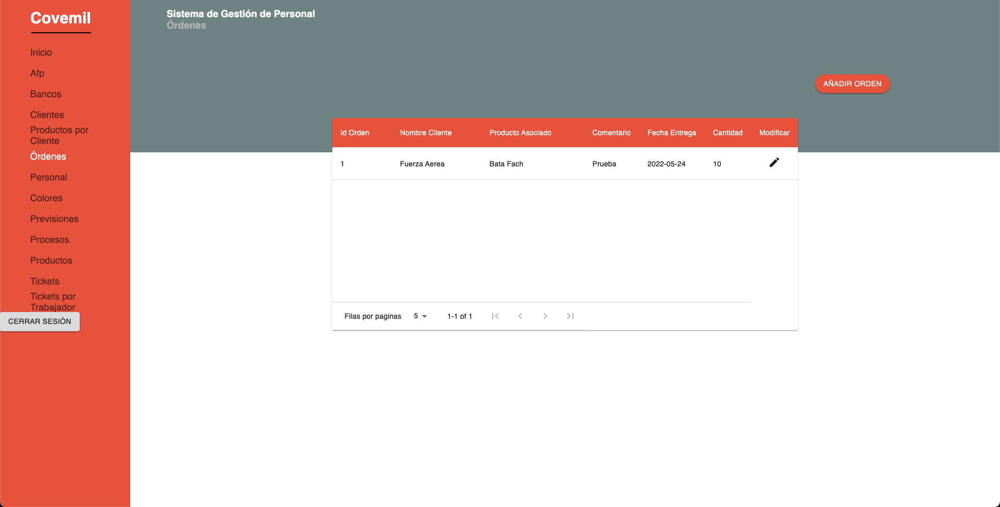
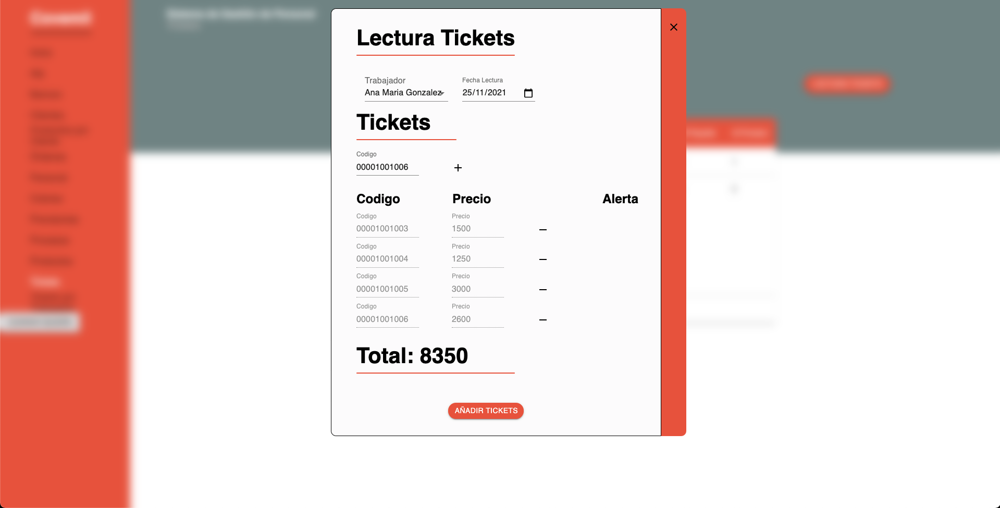

# Gestex
Es un software creado con React.js, MaterialUI, Express, Axios y Node.js. Se usó una base de datos relacional Postgres alojada en Heroku y el deploy de la aplicación se hizo en Netlify.

Este sofware reemplaza al software anterior de pago a trabajadores de la empresa textil Covemil. Un sistema antiguo desarrollado en FoxPro con muchas fallas que no le permitían al administrador tener un flujo de trabajo continuo. Es por esto que nace Gestex.

# ¿Qué hace Gestex?
Sin adentrarse en como trabaja la empresa ya que es más o menos complejo, lo que hace el sistema es: Dada una *Orden de Corte* ingresada por el usuario, se permite una descarga de un archivo excel que es ingresado al programa *GoLabel*, en donde se imprimen stickers con códigos de barra. Estos stickers representan un trabajo que debe realizar un trabajador. Luego de finalizado, el trabajador se queda con el sticker. Luego, a fin de mes o quincena, se leen estos códigos de barra en Gestex y se despliega un total en pesos de lo que hay que pagarle al trabajador. 

# Vistas de Gestex
## Login

## Google Login

# Ordenes de Corte

## Agregar Ordenes de Corte

## Tickets

